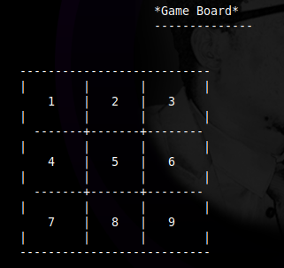
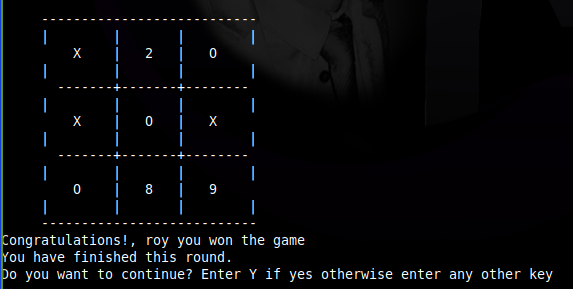

# Tic Tac Toe


> Implementation of tic tack toe game as outlined [here](https://www.theodinproject.com/courses/ruby-programming/lessons/oop) by the Odin Project.

## Description of tic-tac-toe

**Tic-tac-toe** (American English), **noughts and crosses** (British English), or **Xs and Os** is a [paper-and-pencil](https://en.wikipedia.org/wiki/Paper-and-pencil_game) game for two players, X and O, who take turns marking the spaces in a 3×3 grid. The player who succeeds in placing three of their marks in a horizontal, vertical, or diagonal row is the winner. [Read more on wikipedia...](https://en.wikipedia.org/wiki/Tic-tac-toe)

This project is the implementation of that tic-tac-toe, which run on CLI (Command Line Interface), anyone can play it.

|        Game board          |          Winning Borad
-----------------------------|--------------------------------
|  |  |

## Built With
- Ruby

## How to open the tic-tac-toe game?
> This game can be played on two platforms:
> A. Your computer
> B. Online

### A. On your computer

#### Pre-requisite
1. You should have [Ruby](https://www.ruby-lang.org/en/) installed on your computer.
1. Your computer should be able to run `terminal` or `command prompt` or `bash` or `Powershell` commands

#### A. 1. Using Our Release tag
1. [Click here](https://github.com/RNtaate/tic-tac-toe/releases/tag/v1.0.0-beta) and download the zip file of this game
1. Unzip the downloaded file to the folder of your choice
1. Open terminal inside the unzipped folder
1. Run the following command:

```bash
    bin/main.rb
```
5. At that point you should see game starting and follow the rules of the game

#### A. 2. Using repository
1. Run this command `git clone https://github.com/RNtaate/tic-tac-toe.git` to clone the repository to your local computer
1. Run `cd tic-tac-toe`
1. Run the following command:

```bash
    bin/main.rb
```
5. At that point you should see game starting and follow the rules of the game

### B. Online
1. click on one of the following links [descholar's link](https://repl.it/@descholarceo/tic-tac-toe#main.rb) or [Roy's link](https://repl.it/@RNtaate/tic-tac-toe#bin/main.rb)
1. When the link has been opened, click the `green run button` you will see at the top, and follow the game instructions to play.
> Note: Whenever you terminate the game before you start it again, remember to clear your terminal by running this command `clear`

## How to play tic-tac-toe?
1. When the game is opened, it shows all of the instructions and asks you if you want to continue, you are supposed to enter `y` if you want to continue, otherwise enter any other key to terminate the game.
1. When you selected to continue, the game will ask you names for `Player 1` and `Player 2`.
1. After that it will start to show any player turn using the names you have just entered
1. The very first player, will be assigned `X` as their mark which will be displayed on the board in accordance with the position they played / selected
1. The second player, will be assigned `O` as their mark which will be displayed on the board in accordance with the position they played / selected
1. The board is made of nine positions which are numbered, if you enter a number, the number of that position will be replaced with your mark, and it won't be available for being played until `game win` or `game draw`
1. When your mark is aligned horizontally, or vertically, or diagonally, that will be a `game win`
1. When all of the position have been played, without a `game win`, that will be a `game draw`
1. At the end of every `game win` or `draw`, the game will ask if you want to play another round, you are supposed to enter `y` if you want to continue, otherwise enter any other key to terminate the game.

## Authors

👤 **Mugirase Emmanuel**

- Github: [@descholar-ceo](https://github.com/descholar-ceo)
- Twitter: [@descholar3](https://twitter.com/descholar3)
- Linkedin: [MUGIRASE Emmanuel](linkedin.com/in/mugirase-emmanuel-a90b49143)

👤 **Roy Ntaate**

- Github: [@RNtaate](https://github.com/RNtaate)
- Twitter: [@RNtaate](https://twitter.com/RNtaate)
- Linkedin: [roy-ntaate](https://linkedin.com/in/roy-ntaate)


## Show your support

Give a ⭐️ if you like this project!

## Acknowledgments

- [Microverse](htttps:www.microverse.org)
- [The Odin Prohect](https://www.theodinproject.com/)

## 📝 License

This project is [MIT](lic.url) licensed.
